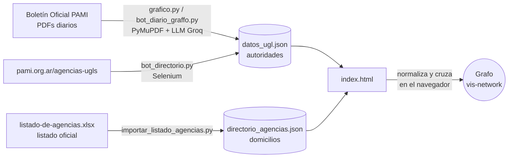

<p align="center">
  
</p>

<h1 align="center">Red Federal UGLs y Agencias – PAMI</h1>

<p align="center">
  Grafo interactivo con las <b>38 Unidades de Gestión Local (UGL)</b> de PAMI y sus <b>Agencias</b>,<br>
  con autoridades vigentes, domicilio, teléfono y ubicación en el mapa.
</p>

---

## ¿Qué es?

Una página web estática (publicada con GitHub Pages) que muestra la estructura territorial de PAMI como una red:

```
PAMI Nivel Central
 └── UGL (38)          ● círculo verde  (gris si todavía no tiene datos)
      └── Agencias     ◆ rombo naranja  (incluye CAPs y Bocas de Atención)
```

Al hacer clic en un nodo, el panel lateral muestra:

- **Ubicación y contacto:** dirección, localidad, teléfono y enlace a Google Maps.
- **Autoridades:** los cargos y las personas designadas según el Boletín Oficial de PAMI.
- **Agencias de la UGL:** lista navegable; cada una abre su propia ficha.

Los datos de las autoridades se extraen automáticamente de los boletines oficiales y los domicilios salen del listado oficial de agencias de PAMI.

> ⚠️ Proyecto independiente, **no oficial**. La información proviene de fuentes públicas de PAMI y puede tener demoras o errores de extracción. Ante cualquier duda, verificar en [pami.org.ar](https://www.pami.org.ar).

---

## Funcionalidades

| Función | Detalle |
|---|---|
| **Intro animada** | Pantalla de presentación con el logo. Se cierra sola cuando el grafo terminó de cargar, o antes con un clic o `Esc`. |
| **Buscador rápido** (sobre el grafo) | Busca por UGL, número romano, localidad o Agencia y acerca la vista al nodo. Se navega con ↑ ↓ y Enter; la tecla `/` pone el cursor en el buscador. |
| **Buscador del panel** | Además de UGLs y Agencias, encuentra **personas** por nombre. |
| **Panel redimensionable** | Arrastrá el borde entre el grafo y el panel para cambiar el ancho. El navegador lo recuerda; con doble clic vuelve al tamaño original. |
| **Filtro de la leyenda** | Muestra u oculta las Agencias. |
| **Alertas de designaciones** | Si un cargo tiene más de una persona registrada, se muestra un aviso para verificar cuál está vigente. |
| **Responsive** | En el celular, el grafo queda arriba y el panel abajo. |

---

## Cómo funciona



### 1. Recolección de datos (Python)

| Script | Qué hace | Cuándo se usa |
|---|---|---|
| `grafico.py` | Descarga los boletines históricos (hasta 24 meses), extrae los párrafos con palabras clave (*designa*, *cese*, *titular*, *UGL*…) y un LLM (Groq) los convierte en registros `{UGL, persona, función, estado}`. Guarda en `pdfs_procesados.txt` cuáles ya analizó, así puede retomar donde quedó. | Carga inicial, una sola vez. |
| `bot_diario_graffo.py` | Hace lo mismo pero solo con el boletín del día, en modo invisible (*headless*). | Todos los días, desde el programador de tareas. |
| `bot_directorio.py` | Recorre el buscador de agencias de pami.org.ar provincia por provincia y guarda teléfono y dirección. Anota su avance en `progreso_directorio.json`. | Ocasional. |
| `importar_listado_agencias.py` | Convierte el Excel oficial de agencias en `directorio_agencias.json` (686 dependencias: UGLs, agencias, bocas y CAPs con domicilio, localidad y coordenadas). | Cada vez que PAMI publique un listado nuevo. |

### 2. Visualización (`index.html`)

La página no necesita servidor ni base de datos: lee los dos JSON y arma el grafo en el navegador. Como los bots guardan los datos **en forma plana y con nombres inconsistentes**, el index los ordena antes de dibujar:

1. **Catálogo oficial de UGLs:** las 38 UGLs con su número romano están fijas en `CATALOGO_UGL`. Las variantes de nombre que aparecen en el JSON (`BAHÍA BLANCA`, `BAHIA BLANCA`, `UGLV – BAHÍA BLANCA`, `PARANA` → Entre Ríos, etc.) se unifican mediante alias.
2. **Localidades cargadas como UGL:** a veces el LLM guarda como UGL la localidad de una agencia (por ejemplo `BANDERA` o `PUERTO DESEADO`). La tabla `LOCALIDAD_A_UGL` las cuelga de su UGL real.
3. **Agencias detectadas en el texto del cargo:** en *"Titular del Centro de Atención Personalizada Villa Elisa"* se reconoce la dependencia *Villa Elisa* y el rol *Titular*. CAPs, Agencias y Bocas de Atención se unifican como **Agencia**.
4. **Duplicados:** se unen los cargos repetidos, con o sin tilde y en mayúsculas o minúsculas (`Natalia Ivana CLEPPE` = `Natalia Ivana Cleppe`). Se descartan los cargos genéricos (*"Titular"*, *"prestar servicios"*) cuando la persona ya figura en una Agencia.
5. **Cruce con el listado oficial:** cada UGL toma el domicilio de su sede y cada Agencia se busca en `directorio_agencias.json` dentro de su UGL. La búsqueda tolera abreviaturas (`PTO`, `GRAL`, `GOB`) y variantes de escritura (`Gonzalez`/`Gonzales`, `Chaves`/`Chavez`). **Solo completa datos faltantes**: nunca pisa lo que viene de `datos_ugl.json`.
6. **Valores inválidos:** se descartan valores basura del scraping, como `"EN CABA"` o `"(0) 0"`.

Para depurar: abrí la consola del navegador y escribí `modeloPAMI` para ver el árbol ya normalizado, o `modeloPAMI.reporteDirectorio` para ver qué Agencias se cruzaron con el listado oficial y cuáles no.

---

## Estructura del repositorio

```
├── index.html                    # Página: intro, grafo, buscadores y panel
├── logo_darsalud.png             # Logo con fondo transparente (usado en la intro)
├── datos_ugl.json                # Autoridades por UGL (lo escriben los bots)
├── directorio_agencias.json      # Domicilios oficiales (lo genera el importador)
│
├── grafico.py                    # Bot histórico de boletines
├── bot_diario_graffo.py          # Bot diario de boletines
├── bot_directorio.py             # Scraper del buscador de agencias
├── importar_listado_agencias.py  # Excel oficial -> directorio_agencias.json
├── requirements.txt
│
├── pdfs_procesados.txt           # Control de avance de grafico.py
├── progreso_directorio.json      # Control de avance de bot_directorio.py
└── organigrama_2025.pdf          # Organigrama de referencia
```

---

## Instalación y uso

### Ver el grafo en tu computadora

Los navegadores no dejan leer archivos JSON si abrís `index.html` con doble clic, por eso hace falta levantar un servidor local:

```bash
python -m http.server 8000
```

Después entrá a **http://localhost:8000**.

### Publicar en GitHub Pages

*Settings → Pages → Branch: `main` / carpeta `root`*. Cada `push` con JSON actualizados se refleja en la web.

### Correr los bots

Requiere **Python 3.10 o superior** y **Google Chrome** instalado (Selenium usa Chrome).

```bash
pip install -r requirements.txt
```

Los bots de boletines necesitan una clave de la API de [Groq](https://console.groq.com). **Nunca la escribas en el código**: definila como variable de entorno.

```bash
# Windows (PowerShell)
$env:GROQ_API_KEY = "tu_clave"
# Linux / macOS
export GROQ_API_KEY="tu_clave"
```

```bash
python grafico.py                 # carga histórica (única vez)
python bot_diario_graffo.py       # actualización del día
python bot_directorio.py          # teléfonos y direcciones desde la web de PAMI
python importar_listado_agencias.py listado-de-agencias-.xlsx
```

Para que la actualización sea diaria, programá `bot_diario_graffo.py` en el **Programador de tareas** de Windows (o con `cron` en Linux) y después hacé `git commit` y `git push` de `datos_ugl.json`.

---

## Mantenimiento

| Situación | Qué hacer |
|---|---|
| Aparece el aviso rojo **"sin clasificar"** | Una clave del JSON no coincide con ninguna UGL. Agregá esa localidad a `LOCALIDAD_A_UGL` en `index.html`, con el número romano de su UGL. |
| Una Agencia no muestra domicilio | No se encontró en el listado oficial con ese nombre. Revisá `modeloPAMI.reporteDirectorio.sinCoincidencia` en la consola. |
| PAMI publicó un listado de agencias nuevo | Descargá el Excel y corré `importar_listado_agencias.py`. |
| Aviso **"designaciones distintas para este cargo"** | Hay dos personas registradas para el mismo cargo y los datos no guardan la fecha de cada designación. Verificar en el boletín. |

### Limitaciones conocidas

- **Teléfonos incompletos:** el listado oficial de agencias no trae teléfono, y `bot_directorio.py` hoy guarda un solo teléfono por UGL: el de la última agencia que recorrió.
- **Orden de los boletines:** los boletines se procesan según la fecha de descarga, no la de publicación, así que ante designaciones contradictorias no se puede saber automáticamente cuál es la más reciente.
- **Posibles errores del LLM:** la extracción con LLM puede equivocarse al interpretar un cargo o una UGL. Por eso el index normaliza y avisa de las inconsistencias en lugar de ocultarlas.

---

## Tecnologías

[vis-network](https://visjs.github.io/vis-network/docs/network/) · HTML/CSS/JS sin frameworks · Python · Selenium · PyMuPDF · Groq API · openpyxl

---

<p align="center"><i>Diseño y desarrollo: Leandro Sesto - 2026</i></p>
