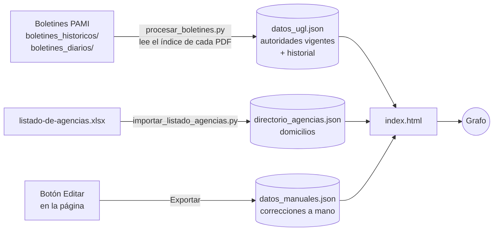

<p align="center">
  
</p>

<h1 align="center">Red Federal UGLs y Agencias – PAMI</h1>

<p align="center">
  Grafo interactivo con las <b>38 Unidades de Gestión Local (UGL)</b> de PAMI y sus <b>Agencias</b>,<br>
  con autoridades vigentes, domicilio, teléfono y ubicación en el mapa.
</p>

---

## ¿Qué es?

Una página web estática (publicada con GitHub Pages) que muestra la estructura territorial de PAMI como una red:

```
PAMI Nivel Central  (al tocarlo despliega el organigrama: Dirección Ejecutiva → unidades → gerencias → subgerencias)
 └── UGL (38)          ● círculo verde  (gris si todavía no tiene datos)
      └── Agencias     ◆ rombo naranja  (incluye CAPs y Bocas de Atención; más oscuro si no tiene titular vigente;
                                        ◇ contorno = solo figura en el listado oficial)
```

Al hacer clic en un nodo, el panel lateral muestra:

- **Ubicación y contacto:** dirección, localidad, teléfono y enlace a Google Maps.
- **Autoridades vigentes:** cargo, persona, fecha desde la que ocupa el cargo y norma que la designó.
- **Historial:** todas las designaciones, ceses y creaciones de dependencias publicadas en los boletines, con fecha.
- **Agencias de la UGL:** lista navegable; cada una abre su propia ficha.

Los datos de las autoridades se extraen automáticamente de los boletines oficiales y los domicilios salen del listado oficial de agencias de PAMI.

> ⚠️ Proyecto independiente, **no oficial**. La información proviene de fuentes públicas de PAMI y puede tener demoras o errores de extracción. Ante cualquier duda, verificar en [pami.org.ar](https://www.pami.org.ar).

---

## Funcionalidades

| Función | Detalle |
|---|---|
| **Intro animada** | Pantalla de presentación con el logo. Se cierra sola cuando el grafo terminó de cargar, o antes con un clic o `Esc`. |
| **Buscador rápido** (sobre el grafo) | Busca por UGL, número romano, localidad o Agencia y acerca la vista al nodo. Se navega con ↑ ↓ y Enter; la tecla `/` pone el cursor en el buscador. |
| **Buscador del panel** | Además de UGLs y Agencias, encuentra **personas** por nombre. |
| **Panel redimensionable** | Arrastrá el borde entre el grafo y el panel para cambiar el ancho. El navegador lo recuerda; con doble clic vuelve al tamaño original. |
| **Autoridades con fecha** | Cada cargo muestra desde cuándo está vigente y la resolución que lo designó. |
| **Historial** | Sección desplegable con todas las novedades de la UGL o de la Agencia, de la más reciente a la más antigua. |
| **Carga manual de datos** | Botón **Editar** en cada ficha para agregar o corregir dirección, teléfono, autoridades y agencias nuevas (ver más abajo). |
| **Despliegue por capas** | Al abrir se ven solo el Nivel Central y las 38 UGL (cada una indica cuántas agencias tiene). Tocar una UGL despliega sus agencias y la vista se acerca; doble clic la pliega. Lo mismo con el organigrama dentro de PAMI Nivel Central. |
| **Red animada** | Pulsos de luz recorren las conexiones desde PAMI Central hacia afuera. Al tocar un nodo, una onda baja por su camino y se reparte a lo que tiene adentro. El botón ✳ de los controles apaga o enciende la animación (se recuerda en el navegador). |
| **Tarjeta al pasar el mouse** | Se ilumina el camino desde PAMI Central hasta el nodo y aparece una tarjeta con el titular, desde cuándo, la dirección y la cantidad de agencias. |
| **Línea de tiempo** | Botón del reloj o tecla **T**. Recorre mes a mes, desde 2020 hasta hoy, todas las designaciones y ceses de los boletines: los nodos con novedades se encienden (verde designación, rojo cese) y el gráfico de barras muestra cuántos cambios hubo cada mes. Se reproduce con ▶ o la barra espaciadora, se avanza con ← →, "Cambios del mes" lista las novedades, y al pasar el mouse por un nodo se ve quién estaba a cargo en ese mes. |
| **Pantalla completa** | Botón en los controles o tecla **F**. |
| **Nodos reubicables** | Arrastrá cualquier nodo; al mover una UGL se mueven también sus agencias. La ubicación queda guardada en el navegador y el botón ↺ la restablece. |
| **Resaltado** | Al elegir una UGL o agencia se atenúa el resto del grafo (Esc lo quita). |
| **Contraer / expandir** | Doble clic en una UGL oculta o muestra sus agencias; un botón lo hace con todas a la vez. |
| **Controles de vista** | Acercar, alejar y ver todo, además de la rueda del mouse. |
| **Listado oficial completo** | También se muestran (con borde punteado) las agencias del listado oficial que no tuvieron novedades en los boletines. Se ocultan desde la leyenda. |
| **Organigrama del Nivel Central** | Queda plegado dentro del nodo **PAMI Nivel Central**. Al tocarlo se despliegan las unidades que dependen de la Dirección Ejecutiva; al tocar cada una se despliegan sus gerencias y subgerencias (doble clic pliega). Cada unidad muestra su titular y las áreas internas designadas según los boletines. |
| **Filtro de la leyenda** | Muestra u oculta las Agencias. |
| **Responsive** | En el celular, el grafo queda arriba y el panel abajo. |

---

## Cómo funciona



### 1. Autoridades: `procesar_boletines.py`

Cada boletín de PAMI empieza con un **índice** donde cada resolución trae un resumen de una línea con formato fijo:

> *Designa y asigna al señor Esteban Maximiliano Herrera, las funciones de titular de la Agencia La Banda. UGL XIX - Santiago del Estero.*

El script lee **solo ese índice** (sin IA ni claves de API) y de cada resumen obtiene la acción, la persona, el cargo, la Agencia y la UGL. Después aplica todos los eventos **en orden cronológico**:

| Resumen del boletín | Efecto |
|---|---|
| *Designa y asigna / Asigna / Limita y asigna / Traslada y asigna ... las funciones de ...* | La persona pasa a ocupar el cargo. Si ya había alguien, lo reemplaza. |
| *Limita a ... las funciones de ...* | Cese: el cargo queda vacante. |
| *Limita y traslada a ...* | La persona deja todos sus cargos en esa UGL. |
| *Delega en ... la firma de ... la UGL* | Se registra como "Firma delegada de la UGL". |
| *Crea la Boca de Atención ...* | Se agrega la dependencia. |
| *Deja sin efecto la RESOL-...* | Se anula el evento de esa resolución. |

Reglas importantes:

- **La fecha es la del boletín** (nombre del archivo `dd-mm-aa.pdf`). Así la información siempre refleja la última publicación.
- Si una persona pasa a ser titular de otra Agencia de la misma UGL, deja la anterior (traslado).
- "Titular de la UGL" y "Titular de la Dirección Ejecutiva Local" se consideran el mismo cargo.
- El resultado se **recalcula completo** en cada corrida, así que es seguro correrlo las veces que haga falta. `cache_indices.json` guarda los índices ya leídos para que sea rápido.
- No se toman como autoridades las designaciones de personal ("para prestar servicios", "desempeñar tareas"), las ampliaciones de carga horaria ni las contrataciones.

**Control de UGL contra el listado oficial:** si un boletín ubica una agencia en una UGL que no le corresponde (por ejemplo *"CAP Monte Quemado, UGL XXXII - Luján"*) y el listado oficial de agencias la tiene en una sola UGL, se usa la del listado; también se corrigen números de UGL mal tipeados cuando el boletín trae el nombre (*"UGL XXX- VIII – Chivilcoy"* → UGL XXXVIII). Cada corrección se informa al correr el script y queda registrada en `datos_ugl.json` (`_meta.ugl_corregida_por_listado`).

**Boletines 2020 a 2023 (formato viejo):** en esos años el índice trae resúmenes abreviados y **sin nombres** (*"Designa y asigna titular CAP Lamadrid. UGL XXX"*). Para esos boletines el script busca la resolución dentro del mismo PDF y lee sus **artículos** (*"ARTÍCULO 2°.- Asignar ... las funciones de titular del Centro de Atención Personalizada Lamadrid ... a la señora ..."*), de donde saca la persona, el cargo y la dependencia. Como todo se aplica en orden cronológico, un dato de 2020 solo queda si **ningún boletín posterior** lo reemplazó; en la página esas designaciones anteriores a 2024 se muestran con la leyenda *"conviene verificar que siga vigente"*.

**Nivel Central:** las designaciones que no corresponden a una UGL se ubican en `organigrama.json`, en este orden: (1) el cargo es la propia unidad ("Titular de la Gerencia de Recursos Humanos"); (2) el cargo menciona a su unidad ("... de la Subgerencia Operativa de UGL Zona 2"); (3) termina con la sigla de la gerencia ("Departamento Penalidades. GAJ"); (4) palabras clave (hospitales propios → Gerencia de Efectores Sanitarios Propios). Lo que no se puede ubicar con certeza se lista aparte en la ficha de la Dirección Ejecutiva.

### 2. Domicilios: `importar_listado_agencias.py`

Convierte el Excel oficial de agencias de PAMI en `directorio_agencias.json` (686 dependencias con domicilio, localidad y coordenadas). El index cruza cada Agencia con ese listado para completar su dirección y el enlace a Google Maps.

### 3. Datos cargados a mano: `datos_manuales.json`

Para lo que no figura en los boletines (teléfonos, un titular que todavía no salió publicado, una agencia nueva):

1. Abrí la ficha de la UGL o Agencia y tocá **Editar**.
2. Completá dirección, localidad, teléfono o autoridades; desde una UGL también podés **agregar una agencia**. Tocá **Guardar**.
3. El cambio se ve al instante y queda guardado **en tu navegador** (aparece con la etiqueta *manual*).
4. Para que lo vea todo el mundo, tocá **Exportar** (arriba, en el panel), y subí el archivo `datos_manuales.json` descargado al repositorio, reemplazando el anterior.

Los datos manuales tienen prioridad sobre los boletines y el listado oficial. **Importar** permite cargar un `datos_manuales.json` de otra persona y **Descartar** borra los cambios que todavía no exportaste.

### 4. Visualización: `index.html`

Página estática que lee los tres JSON y arma el grafo en el navegador con [vis-network](https://visjs.github.io/vis-network/docs/network/). Para depurar, en la consola del navegador: `modeloPAMI` muestra el árbol ya armado.

---

## Estructura del repositorio

```
├── index.html                    # Página: intro, grafo, buscadores, panel y editor
├── logo_darsalud.png             # Logo (intro)
├── datos_ugl.json                # Autoridades vigentes + historial (lo genera procesar_boletines.py)
├── directorio_agencias.json      # Domicilios oficiales (lo genera importar_listado_agencias.py)
├── datos_manuales.json           # Correcciones y agregados a mano (se exporta desde la página)
├── organigrama.json              # Estructura del Nivel Central transcripta del organigrama (Anexo I)
│
├── procesar_boletines.py         # Lee los boletines y genera datos_ugl.json
├── bot_diario_graffo.py          # Descarga el boletín del día y ejecuta procesar_boletines.py
├── descargar_historico.py        # Descarga boletines de un rango de fechas (por defecto 2020-2023)
├── DESCARGAR_2020_2023.bat       # Doble clic en Windows para bajar 2020-2023
├── importar_listado_agencias.py  # Excel oficial -> directorio_agencias.json
├── bot_directorio.py             # Scraper del buscador de agencias (opcional)
├── requirements.txt
│
├── boletines_historicos/         # PDFs dd-mm-aa.pdf (no hace falta subirlos al repo)
├── boletines_diarios/            # PDFs que descarga el bot diario
└── cache_indices.json            # Caché de lectura (se puede borrar sin problema)
```

`grafico.py` y `pdfs_procesados.txt` quedaron reemplazados por `procesar_boletines.py` y ya no se usan.

---

## Instalación y uso

### Ver el grafo en tu computadora

Los navegadores no dejan leer archivos JSON si abrís `index.html` con doble clic, por eso hace falta levantar un servidor local:

```bash
python -m http.server 8000
```

Después entrá a **http://localhost:8000**.

### Publicar en GitHub Pages

*Settings → Pages → Branch: `main` / carpeta `root`*. Cada `push` con JSON actualizados se refleja en la web.

### Actualizar los datos

Requiere **Python 3.10 o superior**; el bot diario además usa **Google Chrome**.

```bash
pip install -r requirements.txt

python procesar_boletines.py          # recalcula datos_ugl.json con todos los PDFs de las carpetas
python bot_diario_graffo.py           # descarga el boletín de hoy y recalcula
python descargar_historico.py         # baja los boletines 2020-2023 que falten y recalcula
python descargar_historico.py 2019-01-01 2019-12-31   # cualquier otro rango
python importar_listado_agencias.py listado-de-agencias-.xlsx
```

Para que la actualización sea diaria, programá `bot_diario_graffo.py` en el **Programador de tareas** de Windows (o con `cron` en Linux) y después hacé `git commit` y `git push` de `datos_ugl.json`.

---

## Mantenimiento

| Situación | Qué hacer |
|---|---|
| Falta un dato que no sale en los boletines | Cargalo con **Editar** y exportá `datos_manuales.json`. |
| Una Agencia no muestra domicilio | No se encontró en el listado oficial con ese nombre. Cargalo a mano con **Editar**. |
| PAMI publicó un listado de agencias nuevo | Descargá el Excel y corré `importar_listado_agencias.py`. |
| Agregaste boletines viejos a la carpeta | Corré `procesar_boletines.py`: reordena todo por fecha solo. |

### Limitaciones conocidas

- **Teléfonos:** ni los boletines ni el listado oficial traen teléfonos; se cargan a mano.
- **Normas en bloque:** las resoluciones que asignan funciones "a los empleados de la UGL ..." traen el detalle en un anexo y no en el índice, por eso no se leen automáticamente.
- **Fecha de vigencia:** se usa la fecha de publicación del boletín, que puede diferir unos días de la fecha "a partir de" de la resolución.
- **Errores de tipeo en los boletines:** se toleran variantes comunes de escritura, pero un nombre muy mal escrito puede generar una agencia duplicada. Se corrige a mano.

---

## Tecnologías

[vis-network](https://visjs.github.io/vis-network/docs/network/) · HTML/CSS/JS sin frameworks · Python · PyMuPDF · Selenium · openpyxl

---

<p align="center"><i>Diseño y desarrollo: Leandro Sesto - 2026</i></p>

### Boletines que faltan en el servidor de PAMI
A veces PAMI publica en la dirección de un día el boletín de otro (p. ej. `08-03-24.pdf` trae el del 08/04/2024). El procesador detecta la fecha real por las fechas de firma de las normas y descarta las copias repetidas. Las normas de esos boletines perdidos se cargan en `normas_faltantes.json`, con los resúmenes del buscador de [pami.org.ar/boletin-oficial](https://www.pami.org.ar/boletin-oficial).
